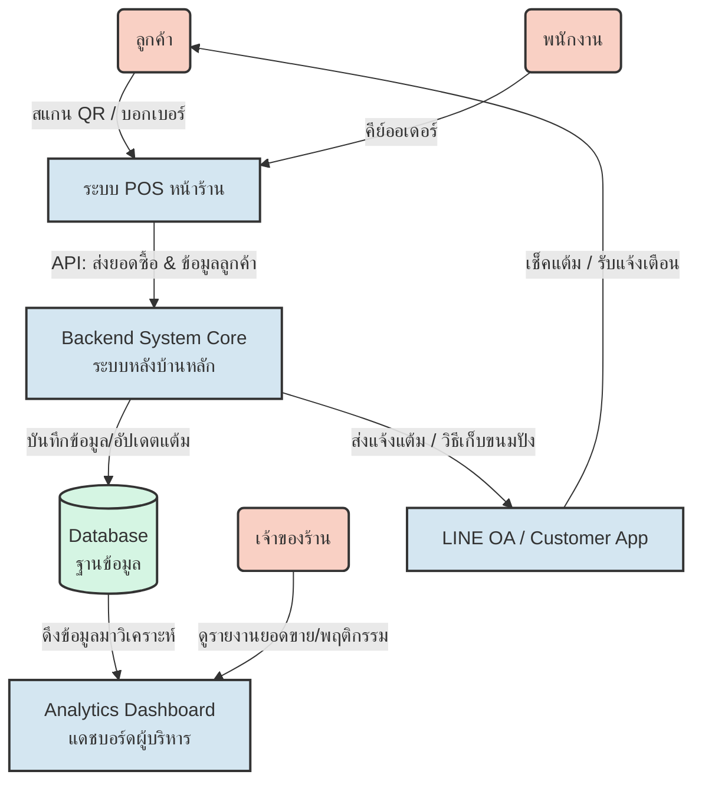
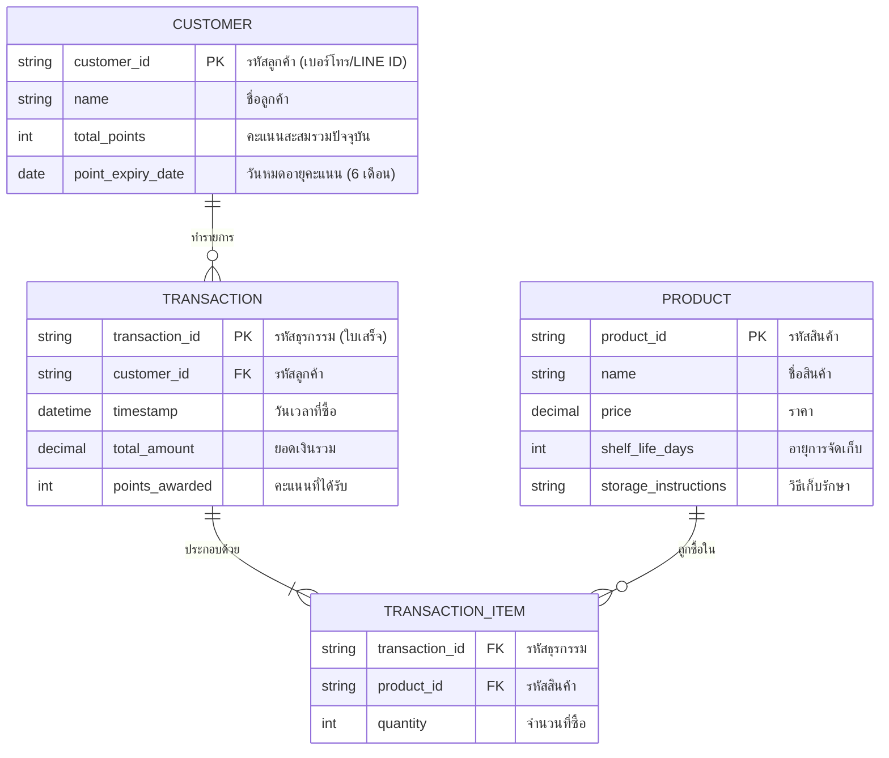
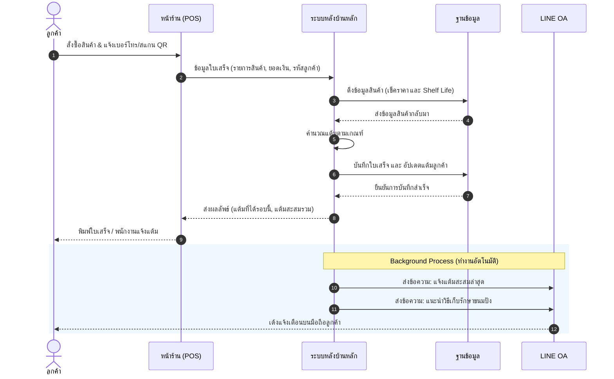
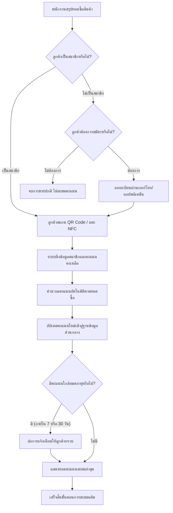

# เอกสารการออกแบบระบบ (Software Design Document)
## ระบบสะสมแต้มร้านขนมปังและเครื่องดื่ม (Bakery & Beverage Loyalty Program System)

---

## 1. บทนำและการกำหนดปัญหา (Problem Definition)
ในสภาวะการแข่งขันที่เข้มข้น การขาดระบบบริหารจัดการสมาชิกและบันทึกคะแนนสะสมผ่านแอปพลิเคชัน ส่งผลกระทบต่อการรักษาฐานลูกค้าประจำ (Customer Retention) ปัญหาที่พบคือ:
- การใช้บัตรสะสมคะแนนกระดาษเสี่ยงต่อการสูญหาย และลืมนำมาใช้
- ขาดระบบดิจิทัลในการจัดเก็บข้อมูลเชิงพฤติกรรม เพื่อนำไปกำหนดโปรโมชั่น
- ลูกค้าไม่สามารถตรวจสอบสถานะคะแนนได้แบบเรียลไทม์
- ขาดช่องทางสื่อสารโปรโมชั่น ข่าวสาร และคำแนะนำการเก็บรักษาสินค้า

## 2. กลุ่มผู้ใช้งาน (Stakeholders)
- **ลูกค้า (Customer):** ต้องการตรวจสอบคะแนน แลกรางวัล เข้าถึงง่ายผ่าน QR/NFC และรับคำแนะนำการเก็บรักษาสินค้า
- **พนักงาน (Staff):** ต้องการระบบบันทึกคะแนนที่รวดเร็ว แม่นยำ ไม่เป็นภาระในชั่วโมงเร่งด่วน
- **เจ้าของร้าน (Owner/Manager):** ต้องการข้อมูลสรุปยอดขาย (Dashboard) และการจัดการข้อมูลสมาชิกแบบรวมศูนย์ (Centralized Data)

## 3. ความต้องการของระบบ (System Requirements)
- **ระบบสมาชิกแบบไฮบริด:** รองรับบัตร Physical และ Mobile App / สแกน QR / แตะ NFC
- **ระบบจัดการเมนูและอายุสินค้า (Shelf Life):** 
  - ขนมปังสด/โฮมเมด: ระบบคำนวณวันหมดอายุอัตโนมัติ 7 วัน นับจากวันที่ผลิต
  - ขนมปังสำเร็จรูป: ระบบคำนวณวันหมดอายุอัตโนมัติ 2 เดือน นับจากวันที่ผลิต
- **ระบบคำนวณคะแนนอัตโนมัติ:** 
  - 20 บาท = 1 คะแนน
  - 50 บาท = 2 คะแนน
  - 60 บาท = 3 คะแนน
  - 100 บาท = 5 คะแนน
- **ระบบแจ้งเตือนวันหมดอายุคะแนน:** คะแนนมีอายุ 6 เดือน เตือนครั้งที่ 1 (ก่อน 30 วัน) และ ครั้งที่ 2 (ก่อน 7 วัน)

---

## 4. แผนผังภาพรวมระบบ (System Architecture)
แสดงการเชื่อมต่อระหว่าง หน้าร้าน, ระบบหลังบ้าน, ฐานข้อมูล และ LINE OA

---

## 5. แผนภาพโครงสร้างฐานข้อมูล (ER Diagram)
การออกแบบ Database เบื้องต้นสำหรับจัดเก็บข้อมูลลูกค้า, ใบเสร็จ และสินค้า

---

## 6. ลำดับขั้นตอนการทำงาน (Sequence Diagram)
อธิบายลำดับการคุยกันของระบบ (API Flow) ตั้งแต่หน้าร้านไปจนถึงส่งแจ้งเตือน

---

## 7. ขั้นตอนการสแกนสะสมแต้มหน้าร้าน (Flowchart)
เส้นทางการทำงานของพนักงานและลูกค้า (User Journey) ที่หน้าเคาน์เตอร์

